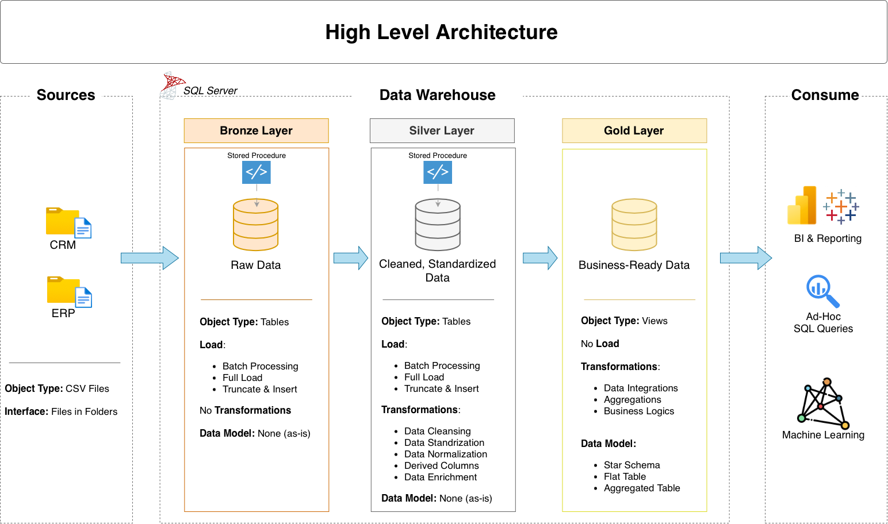

# sql-data-warehouse-project
Building a modern data warehouse with MySQL, including ETL process, data modeling, and analytics

# Data Warehouse and Analytics Project

Welcome to the **Data Warehouse and Analytics Project** repository! 🚀  
This project demonstrates a comprehensive data warehousing and analytics solution, from building a data warehouse to generating actionable insights. Designed as a portfolio project, it highlights industry best practices in data engineering and analytics.

---
## 🏗️ Data Architecture

The data architecture for this project follows Medallion Architecture **Bronze**, **Silver**, and **Gold** layers:

1. **Bronze Layer**: Stores raw data as-is from the source systems. Data is ingested from CSV Files into a MySQL Database.
2. **Silver Layer**: This layer includes data cleansing, standardization, and normalization processes to prepare data for analysis.
3. **Gold Layer**: Houses business-ready data modeled into a star schema required for reporting and analytics.

---
## 🔄 Why MySQL Instead of SQL Server

This project follows Data with Baraa's original SQL Server course, but is fully implemented in MySQL Workbench. Key adaptations:

- **No nested schemas**: MySQL has no SQL Server-style schemas inside a database, so each layer is its own database (`datawarehouse_bronze`, `datawarehouse_silver`, `datawarehouse_gold`) instead of `bronze`/`silver`/`gold` schemas in one database.
- **Data loading**: `BULK INSERT` replaced with `LOAD DATA LOCAL INFILE`, including handling for `\r\n` line endings and blank-to-NULL conversion via `NULLIF`.
- **Stored procedures**: MySQL disallows `LOAD DATA` inside stored procedures, so the bronze load stays a plain reusable script (`load_bronze.sql`) while silver and gold use MySQL stored procedures (`load_silver()`), matching the original design as closely as MySQL allows.
- **Function equivalents**: `ISNULL` → `IFNULL`, `GETDATE()` → `NOW()`/`CURDATE()`, `LEN()` → `LENGTH()`, SQL Server date arithmetic (`date - 1`) → `DATE_SUB(..., INTERVAL 1 DAY)`.

---
## 📖 Project Overview

This project involves:

1. **Data Architecture**: Designing a Modern Data Warehouse Using Medallion Architecture **Bronze**, **Silver**, and **Gold** layers.
2. **ETL Pipelines**: Extracting, transforming, and loading data from source systems into the warehouse.
3. **Data Modeling**: Developing fact and dimension tables optimized for analytical queries.
4. **Analytics & Reporting**: Creating SQL-based reports and dashboards for actionable insights.

🎯 This repository is an excellent resource for professionals and students looking to showcase expertise in:
- SQL Development
- Data Architect
- Data Engineering  
- ETL Pipeline Developer  
- Data Modeling  
- Data Analytics  

---

## 🚀 Project Requirements

### Building the Data Warehouse (Data Engineering)

#### Objective
Develop a modern data warehouse using MySQL to consolidate sales data, enabling analytical reporting and informed decision-making.

#### Specifications
- **Data Sources**: Import data from two source systems (ERP and CRM) provided as CSV files.
- **Data Quality**: Cleanse and resolve data quality issues prior to analysis.
- **Integration**: Combine both sources into a single, user-friendly data model designed for analytical queries.
- **Scope**: Focus on the latest dataset only; historization of data is not required.
- **Documentation**: Provide clear documentation of the data model to support both business stakeholders and analytics teams.

---

### BI: Analytics & Reporting (Data Analysis)

#### Objective
Develop SQL-based analytics to deliver detailed insights into:
- **Customer Behavior**
- **Product Performance**
- **Sales Trends**

These insights empower stakeholders with key business metrics, enabling strategic decision-making.  

For more details, refer to [docs/requirements.md](docs/requirements.md).

## 📂 Repository Structure
data-warehouse-project/
│
├── datasets/ # Raw datasets used for the project (ERP and CRM data)
│
├── docs/ # Project documentation and architecture details
│ ├── etl.drawio # Draw.io file shows all different techniquies and methods of ETL
│ ├── data_architecture.drawio # Draw.io file shows the project's architecture
│ ├── data_catalog.md # Catalog of datasets, including field descriptions and metadata
│ ├── data_flow.drawio # Draw.io file for the data flow diagram
│ ├── data_models.drawio # Draw.io file for data models (star schema)
│ ├── naming-conventions.md # Consistent naming guidelines for tables, columns, and files
│
├── scripts/ # SQL scripts for ETL and transformations
│ ├── bronze/ # Scripts for extracting and loading raw data
│ ├── silver/ # Scripts for cleaning and transforming data
│ ├── gold/ # Scripts for creating analytical models
│
├── tests/ # Test scripts and quality files
│
├── README.md # Project overview and instructions
├── LICENSE # License information for the repository
├── .gitignore # Files and directories to be ignored by Git
└── requirements.txt # Dependencies and requirements for the project

> Note: `scripts/bronze/silver/gold` folders map to separate MySQL databases (`datawarehouse_bronze`, etc.), not schemas — see "Why MySQL Instead of SQL Server" above.

---

## 🛡️ License

This project is licensed under the [MIT License](LICENSE). You are free to use, modify, and share this project with proper attribution.

## 🌟 About Me

Hi there! I'm **Mohd Asif**,. I'm an IT professional and passionate coder on a mission to share knowledge and make working with data enjoyable and engaging!
